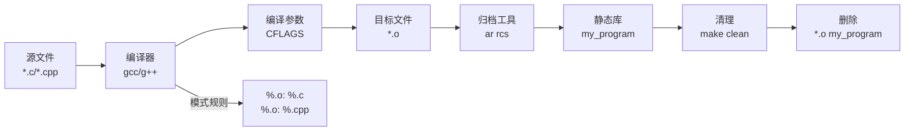

# 1、项目概述

<details>
<summary>相关源文件</summary>
SAGA_CheckerCase/Makefile
SAGA_CheckerCase/DOUBLE_FREE_S.c
SAGA_CheckerCase/NPD_CMP_S.c
SAGA_CheckerCase/CONC_NO_LOCK_S.c
SAGA_CheckerCase/MEMORY_LEAK_S.c
SAGA_CheckerCase/OOB_READ_S.c
SAGA_CheckerCase/DELETE_ARRAY.cpp
SAGA_CheckerCase/VIRTUAL_DTOR.cpp
</details>

## 概述

SAGA Checker测试用例库是一个专门用于静态代码分析工具的标准化测试用例库，包含130+个C/C++测试文件，覆盖多种安全漏洞类型。项目的主要用途是验证静态分析工具的检测能力，为开发者提供标准化的缺陷测试样本，每个测试用例都包含缺陷版本（BAD）和修复版本（GOOD）的对比代码，并通过标准化的注释标注缺陷点和修复点。

## 项目简介

SAGA Checker测试用例库是为静态代码分析工具（SAGA Checker）设计的标准化测试集，旨在提供全面的漏洞检测验证基准。该项目通过精心设计的测试用例，覆盖了C/C++编程中常见的安全漏洞类型和编码错误，包括内存安全、并发安全、类型转换、空指针解引用、缓冲区溢出、资源管理、算术运算以及C++特定问题等八大安全领域。

每个测试用例文件都遵循统一的命名规范（`VULNERABILITY_TYPE_S.c/cpp`），其中`_S`后缀明确标识该文件为静态分析测试。文件内部采用BAD/GOOD对比模式，BAD函数展示包含漏洞的缺陷代码，GOOD函数展示修复后的正确实现，两者形成鲜明对比，帮助开发者直观理解漏洞特征和修复方法。所有测试用例通过标准化的注释标注缺陷点（SinkLine）和修复点，包含详细的中文说明，明确解释漏洞产生的原因和位置。

该测试用例库不仅用于验证静态分析工具的检测能力，还为安全研究、代码审计和编程教育提供了宝贵的参考资源。通过分析这些测试用例，开发者可以学习常见的安全漏洞模式，理解C/C++语言中的潜在风险点，并掌握正确的编码实践。

## 目标用户

### 静态分析工具开发者

静态分析工具开发者是本测试用例库的核心用户群体。开发者可以使用这些标准化测试用例来验证和评估静态分析工具的检测能力，包括：

- **工具能力验证**：通过运行工具对130+个测试用例进行分析，验证工具能否准确识别各类安全漏洞
- **误报/漏报分析**：通过对比BAD/GOOD函数的实现，分析工具的误报率和漏报率
- **算法优化**：针对特定类型漏洞的检测算法进行优化改进，提高检测精度
- **回归测试**：在工具升级或算法修改后，使用测试用例进行回归测试，确保检测能力不退化

### 安全研究员

安全研究员可以使用本测试用例库进行以下研究工作：

- **漏洞模式研究**：分析不同类型漏洞的产生条件和触发机制，建立漏洞模式库
- **安全领域探索**：深入研究内存安全、并发安全等特定领域的安全问题
- **攻击向量分析**：理解各种漏洞如何被攻击者利用，评估安全风险等级
- **检测方法研究**：研究新的静态分析方法和技术，提升漏洞检测能力

### 代码审计人员

代码审计人员可以利用测试用例库提升审计效率和质量：

- **审计标准参考**：将测试用例作为代码审计的检查清单，确保覆盖常见漏洞类型
- **漏洞识别训练**：通过学习BAD函数的缺陷模式，提升代码中识别类似问题的能力
- **修复方案参考**：参考GOOD函数的修复方法，为发现的问题提供解决方案
- **量化评估**：使用测试用例对代码质量进行量化评估，生成审计报告

### C/C++开发者

C/C++开发者可以通过测试用例库学习安全的编程实践：

- **常见错误学习**：学习C/C++编程中常见的错误和漏洞，避免在代码中重复出现
- **最佳实践参考**：参考GOOD函数的正确实现，学习安全的编码模式
- **语言特性理解**：深入理解C/C++语言特性的使用场景和潜在风险
- **代码审查提升**：提升代码审查能力，能够识别同事代码中的安全问题

## 技术栈概览

### 编程语言

**C语言**
- **作用**：为主要测试语言，用于测试C语言特有的安全漏洞
- **版本要求**：符合C89/C99标准，确保广泛兼容性
- **使用场景**：用于测试内存管理、指针操作、并发编程等C语言核心特性相关的漏洞

**C++语言**
- **作用**：为次要测试语言，用于测试C++特有的安全漏洞和面向对象相关问题
- **版本要求**：支持主流C++标准（C++98/03/11/14/17）
- **使用场景**：用于测试虚析构函数、删除运算符、异常处理、构造函数初始化等C++特定问题

### 编译工具

**GCC（GNU Compiler Collection）**
- **版本要求**：GCC 4.8及以上版本
- **作用**：将C/C++源文件编译为目标文件和静态库
- **编译参数**：使用`-Wall`（开启所有警告）、`-g`（生成调试信息）、`-Wno-return-type`、`-Wno-implicit-function-declaration`、`-Wno-int-conversion`等参数，平衡警告级别和编译通过率

### 构建工具

**Make**
- **作用**：自动化构建和管理测试用例库
- **配置文件**：[`SAGA_CheckerCase/Makefile`](SAGA_CheckerCase/Makefile)
- **常用命令**：
  - `make`：编译所有测试文件，生成静态库`my_program`
  - `make clean`：清理生成的目标文件和静态库
  - 使用`ar rcs`命令将所有`.o`目标文件打包成静态库

**构建流程**：


### 静态分析工具

**SAGA Checker**
- **作用**：本测试用例库的目标测试工具
- **能力范围**：静态代码分析，检测C/C++代码中的安全漏洞和编码错误
- **验证方法**：对测试用例库进行分析，验证能否正确识别BAD函数中的漏洞，避免误报GOOD函数

### 技术选择理由

**选择C/C++作为测试语言**：
- C/C++是系统级开发的主流语言，安全漏洞风险高
- C/C++涉及内存管理、指针操作等底层特性，容易出现各种安全问题
- 静态分析工具在C/C++领域应用广泛，测试需求迫切

**使用GCC编译器**：
- GCC是开源社区最常用的C/C++编译器，兼容性好
- 支持跨平台编译，方便在不同环境下测试
- 提供丰富的编译选项，便于控制编译过程

**使用Make构建系统**：
- Make是经典的构建工具，简单高效
- 适合批量编译和管理大量测试文件
- 易于扩展和维护，支持自定义编译规则

## 项目结构

### 目录结构

```
CodeRabbit-Test/
├── README.md                          # 项目根目录说明文件
├── .cospec/                          # 项目配置和文档目录
│   └── wiki/                         # 技术文档目录
│       ├── .staging/                 # 文档生成暂存目录
│       │   ├── basic_analyze.json    # 项目基础分析结果
│       │   └── catalogue.json        # 文档目录索引
│       └── [技术文档文件]
│
└── SAGA_CheckerCase/                 # 测试用例主目录（130+个测试文件）
    ├── Makefile                       # 构建配置文件
    ├── README                         # 测试用例说明文件
    │
    ├── 内存安全测试模块
    │   ├── DOUBLE_FREE_S.c          # 双重释放测试
    │   ├── MEMORY_LEAK_S.c          # 内存泄漏测试
    │   ├── USE_AFTER_FREE_S.c       # 释放后使用测试
    │   ├── HEAP_OVERFLOW_S.c        # 堆溢出测试
    │   └── STACK_OVERFLOW_S.c       # 栈溢出测试
    │
    ├── 空指针解引用测试模块
    │   ├── NPD_CMP_S.c              # NULL检查比较后解引用测试
    │   ├── NPD_COMMON_S.c           # 常见空指针解引用测试
    │   ├── NPD_NFR_S.c              # 非形式返回值空指针测试
    │   └── NPD_DYNAMIC_CAST_S.cpp   # 动态转换空指针测试
    │
    ├── 并发安全测试模块
    │   ├── CONC_NO_LOCK_S.c         # 缺少锁测试
    │   ├── CONC_DLOCK_S.c           # 双重锁测试
    │   ├── CONC_DUNLOCK_S.c         # 双重解锁测试
    │   ├── RACE_CONDITION_WITHIN_THREAD_S.c  # 线程内竞态测试
    │   ├── DEAD_MUTEX_S_BAD.c       # 死锁缺陷测试
    │   └── DEAD_MUTEX_S_GOOD.c      # 死锁修复测试
    │
    ├── 类型转换与指针操作测试模块
    │   ├── INCOMPATIBLE_CAST_S.c    # 不兼容类型转换测试
    │   ├── POR_IMCOMPATIBLE_TYPE_S.c  # 指针不兼容类型测试
    │   ├── POR_FPTR_TO_NFPTR_S.c    # 函数指针到非函数指针测试
    │   └── POR_PTR_BTW_NPTR_S.c     # 指针与非指针测试
    │
    ├── 缓冲区溢出测试模块
    │   ├── OOB_READ_S.c             # 越界读取测试
    │   ├── OOB_WRITE_S.c            # 越界写入测试
    │   ├── NEGATIVE_INDEX_READ_S.c  # 负索引读取测试
    │   └── NEGATIVE_INDEX_WRITE_S.c # 负索引写入测试
    │
    ├── 资源管理测试模块
    │   ├── RESOURCE_LEAK_S.c        # 资源泄漏测试
    │   ├── BAD_FILE_OPEN_S.c        # 文件打开错误测试
    │   ├── CHECKED_RETURN_S.c       # 返回值检查测试
    │   └── CHECKED_RETURN_BEFORE_S.c # 使用前返回值检查测试
    │
    ├── 算术运算测试模块
    │   ├── BAD_SHIFT.c              # 错误位移测试
    │   ├── BAD_ALLOC_ARITHMETIC_S.c # 分配算术错误测试
    │   └── DIVIDE_BY_ZERO_S.c       # 除零错误测试
    │
    └── C++特定测试模块
        ├── DELETE_ARRAY.cpp         # 数组删除测试
        ├── DELETE_VOID.cpp          # void指针删除测试
        ├── UNCAUGHT_EXCEPT.cpp      # 未捕获异常测试
        ├── UNINIT_IN_CTOR_S.cpp     # 构造函数未初始化测试
        ├── VCALL_IN_CTOR_DTOR.cpp   # 构造/析构函数虚调用测试
        └── VIRTUAL_DTOR.cpp         # 虚析构函数测试
```

### 文件组织说明

**根目录文件**

[`README.md`](README.md)：
- 当前仅包含项目名称"CodeRabbit-Test"
- 表明这是测试项目的根目录

**测试用例目录**

`SAGA_CheckerCase/`：包含所有测试用例的主目录
- 命名规则：`VULNERABILITY_TYPE_S.c/cpp`
- `_S`后缀：表示静态分析测试（Static Analysis）
- 文件数量：130+个测试文件
- 文件扩展名：`.c`（C语言测试文件）或`.cpp`（C++语言测试文件）

[`SAGA_CheckerCase/Makefile`](SAGA_CheckerCase/Makefile)：
- 定义编译器和编译参数（[`CC`](SAGA_CheckerCase/Makefile:2)、[`CXX`](SAGA_CheckerCase/Makefile:3)、[`CFLAGS`](SAGA_CheckerCase/Makefile:4)）
- 源文件匹配规则（[`$(wildcard *.c)`](SAGA_CheckerCase/Makefile:5)、[`$(wildcard *.cpp)`](SAGA_CheckerCase/Makefile:6)）
- 编译规则：将`.c/.cpp`编译为`.o`目标文件（[`](SAGA_CheckerCase/Makefile:20-26)[`](SAGA_CheckerCase/Makefile:20-26)[`](SAGA_CheckerCase/Makefile:20-26)[`](SAGA_CheckerCase/Makefile:20-26)[`](SAGA_CheckerCase/Makefile:20-26)[`](SAGA_CheckerCase/Makefile:20-26)[`](SAGA_CheckerCase/Makefile:20-26)[`](SAGA_CheckerCase/Makefile:20-26)[`](SAGA_CheckerCase/Makefile:20-26)[`](SAGA_CheckerCase/Makefile:20-26)[`](SAGA_CheckerCase/Makefile:20-26)[`](SAGA_CheckerCase/Makefile:20-26)[`](SAGA_CheckerCase/Makefile:20-26)[`](SAGA_CheckerCase/Makefile:20-26)[`](SAGA_CheckerCase/Makefile:20-26)[`](SAGA_CheckerCase/Makefile:20-26)[`](SAGA_CheckerCase/Makefile:20-26)[`](SAGA_CheckerCase/Makefile:20-26)[`](SAGA_CheckerCase/Makefile:20-26)[`](SAGA_CheckerCase/Makefile:20-26)[`](SAGA_CheckerCase/Makefile:20-26)[`](SAGA_CheckerCase/Makefile:20-26)[`](SAGA_CheckerCase/Makefile:20-26)[`](SAGA_CheckerCase/Makefile:20-26)[`](SAGA_CheckerCase/Makefile:20-26)[`](SAGA_CheckerCase/Makefile:20-26)[`](SAGA_CheckerCase/Makefile:20-26)[`](SAGA_CheckerCase/Makefile:20-26)[`](SAGA_CheckerCase/Makefile:20-26)[`](SAGA_CheckerCase/Makefile:20-26)[`](SAGA_CheckerCase/Makefile:20-26)[`](SAGA_CheckerCase/Makefile:20-26)[`](SAGA_CheckerCase/Makefile:20-26)[`](SAGA_CheckerCase/Makefile:20-26)[`](SAGA_CheckerCase/Makefile:20-26)[`](SAGA_CheckerCase/Makefile:20-26)[`](SAGA_CheckerCase/Makefile:20-26)[`](SAGA_CheckerCase/Makefile:20-26)[`](SAGA_CheckerCase/Makefile:20-26)[`](SAGA_CheckerCase/Makefile:20-26)[`](SAGA_CheckerCase/Makefile:20-26)[`](SAGA_CheckerCase/Makefile:20-26)[`](SAGA_CheckerCase/Makefile:20-26)[`](SAGA_CheckerCase/Makefile:20-26)[`](SAGA_CheckerCase/Makefile:20-26)[`](SAGA_CheckerCase/Makefile:20-26)[`](SAGA_CheckerCase/Makefile:20-26)[`](SAGA_CheckerCase/Makefile:20-26)[`](SAGA_CheckerCase/Makefile:20-26)[`](SAGA_CheckerCase/Makefile:20-26)[`](SAGA_CheckerCase/Makefile:20-26)[`](SAGA_CheckerCase/Makefile:20-26)[`](SAGA_CheckerCase/Makefile:20-26)[`](SAGA_CheckerCase/Makefile:20-26)[`](SAGA_CheckerCase/Makefile:20-26)[`](SAGA_CheckerCase/Makefile:20-26)[`](SAGA_CheckerCase/Makefile:20-26)[`](SAGA_CheckerCase/Makefile:20-26)[`](SAGA_CheckerCase/Makefile:20-26)[`](SAGA_CheckerCase/Makefile:20-26)[`](SAGA_CheckerCase/Makefile:20-26)[`](SAGA_CheckerCase/Makefile:20-26)[`](SAGA_CheckerCase/Makefile:20-26)[`](SAGA_CheckerCase/Makefile:20-26)[`](SAGA_CheckerCase/Makefile:20-26)[`](SAGA_CheckerCase/Makefile:20-26)[`](SAGA_CheckerCase/Makefile:20-26)[`](SAGA_CheckerCase/Makefile:20-26)[`](SAGA_CheckerCase/Makefile:20-26)[`](SAGA_CheckerCase/Makefile:20-26)[`](SAGA_CheckerCase/Makefile:20-26)[`](SAGA_CheckerCase/Makefile:20-26)[`](SAGA_CheckerCase/Makefile:20-26)[`](SAGA_CheckerCase/Makefile:20-26)[`](SAGA_CheckerCase/Makefile:20-26)[`](SAGA_CheckerCase/Makefile:20-26)[`](SAGA_CheckerCase/Makefile:20-26)[`](SAGA_CheckerCase/Makefile:20-26)[`](SAGA_CheckerCase/Makefile:20-26)[`](SAGA_CheckerCase/Makefile:20-26)[`](SAGA_CheckerCase/Makefile:20-26)[`](SAGA_CheckerCase/Makefile:20-26)[`](SAGA_CheckerCase/Makefile:20-26)[`](SAGA_CheckerCase/Makefile:20-26)[`](SAGA_CheckerCase/Makefile:20-26)[`](SAGA_CheckerCase/Makefile:20-26)[`](SAGA_CheckerCase/Makefile:20-26)[`](SAGA_CheckerCase/Makefile:20-26)[`](SAGA_CheckerCase/Makefile:20-26)[`](SAGA_CheckerCase/Makefile:20-26)[`](SAGA_CheckerCase/Makefile:20-26)[`](SAGA_CheckerCase/Makefile:20-26)[`](SAGA_CheckerCase/Makefile:20-26)[`](SAGA_CheckerCase/Makefile:20-26)[`](SAGA_CheckerCase/Makefile:20-26)[`](SAGA_CheckerCase/Makefile:20-26)[`](SAGA_CheckerCase/Makefile:20-26)[`](SAGA_CheckerCase/Makefile:20-26)][`](SAGA_CheckerCase/Makefile:15-18)、使用[`ar rcs`](SAGA_CheckerCase/Makefile:17)打包为静态库
- 提供清理和运行规则（[`clean`](SAGA_CheckerCase/Makefile:28-30)、[`run`](SAGA_CheckerCase/Makefile:32-35)）

[`SAGA_CheckerCase/README`](SAGA_CheckerCase/README)：
- 测试用例说明文件（当前内容为乱码或空）

### 测试文件结构

每个测试文件遵循统一的结构格式：

**头部注释块**：
```c
/**
    Filename: DOUBLE_FREE_S.c
    Vuln: DOUBLE_FREE_S
    SourceLine: -1
    SinkLine: 21
    Comment: 双重释放
*/
```
- [`Filename`](SAGA_CheckerCase/DOUBLE_FREE_S.c:2)：文件名
- [`Vuln`](SAGA_CheckerCase/DOUBLE_FREE_S.c:3)：漏洞类型标识
- [`SourceLine`](SAGA_CheckerCase/DOUBLE_FREE_S.c:4)：漏洞源代码行（-1表示未指定）
- [`SinkLine`](SAGA_CheckerCase/DOUBLE_FREE_S.c:5)：漏洞触发位置（缺陷点所在行号）
- [`Comment`](SAGA_CheckerCase/DOUBLE_FREE_S.c:6)：中文说明，描述漏洞类型和特征

**缺陷函数（BAD）**：
```c
void DOUBLE_FREE_S_BAD()
{
    int a = getvalue();
    char* ptr = (char*)malloc(sizeof(char));
    if (a) {
        /* do something */
        free(ptr);
    }
    /* do something */
    free(ptr);      //缺陷点：存在一条可达路径对ptr指针进行了两次free
}
```
- 函数命名规则：`VULNERABILITY_TYPE_BAD()`
- 包含特定的编程错误或安全漏洞
- 通过注释标注缺陷点，解释漏洞产生的原因
- 对应[`SinkLine`](SAGA_CheckerCase/DOUBLE_FREE_S.c:5)标注的行号

**修复函数（GOOD）**：
```c
void DOUBLE_FREE_S_GOOD()
{
    int a = getvalue();
    char* ptr = (char*)malloc(sizeof(char));
    if (a) {
        /* do something */
        free(ptr);
        return;
    }
    /* do something */
    free(ptr); // 修复点：第一次free后会退出函数
}
```
- 函数命名规则：`VULNERABILITY_TYPE_GOOD()`
- 展示正确的、安全的实现方式
- 通过注释标注修复点，说明如何修复漏洞
- 保持代码结构与BAD函数相似，便于对比学习

### 逻辑分类

测试文件按照安全领域进行逻辑分类，共涵盖8大领域：

**1. 内存安全测试模块**（5个测试文件）
- 双重释放（[`DOUBLE_FREE_S.c`](SAGA_CheckerCase/DOUBLE_FREE_S.c)）
- 内存泄漏（[`MEMORY_LEAK_S.c`](SAGA_CheckerCase/MEMORY_LEAK_S.c)）
- 释放后使用（[`USE_AFTER_FREE_S.c`](SAGA_CheckerCase/USE_AFTER_FREE_S.c)）
- 堆溢出（[`HEAP_OVERFLOW_S.c`](SAGA_CheckerCase/HEAP_OVERFLOW_S.c)）
- 栈溢出（[`STACK_OVERFLOW_S.c`](SAGA_CheckerCase/STACK_OVERFLOW_S.c)）

**2. 空指针解引用测试模块**（4个测试文件）
- NULL检查比较后解引用（[`NPD_CMP_S.c`](SAGA_CheckerCase/NPD_CMP_S.c)）
- 常见空指针解引用（[`NPD_COMMON_S.c`](SAGA_CheckerCase/NPD_COMMON_S.c)）
- 非形式返回值空指针（[`NPD_NFR_S.c`](SAGA_CheckerCase/NPD_NFR_S.c)）
- 动态转换空指针（[`NPD_DYNAMIC_CAST_S.cpp`](SAGA_CheckerCase/NPD_DYNAMIC_CAST_S.cpp)）

**3. 并发安全测试模块**（6个测试文件）
- 缺少锁（[`CONC_NO_LOCK_S.c`](SAGA_CheckerCase/CONC_NO_LOCK_S.c)）
- 双重锁（[`CONC_DLOCK_S.c`](SAGA_CheckerCase/CONC_DLOCK_S.c)）
- 双重解锁（[`CONC_DUNLOCK_S.c`](SAGA_CheckerCase/CONC_DUNLOCK_S.c)）
- 线程内竞态条件（[`RACE_CONDITION_WITHIN_THREAD_S.c`](SAGA_CheckerCase/RACE_CONDITION_WITHIN_THREAD_S.c)）
- 死锁缺陷（[`DEAD_MUTEX_S_BAD.c`](SAGA_CheckerCase/DEAD_MUTEX_S_BAD.c)）
- 死锁修复（[`DEAD_MUTEX_S_GOOD.c`](SAGA_CheckerCase/DEAD_MUTEX_S_GOOD.c)）

**4. 类型转换与指针操作测试模块**（4个测试文件）
- 不兼容类型转换（[`INCOMPATIBLE_CAST_S.c`](SAGA_CheckerCase/INCOMPATIBLE_CAST_S.c)）
- 指针不兼容类型（[`POR_IMCOMPATIBLE_TYPE_S.c`](SAGA_CheckerCase/POR_IMCOMPATIBLE_TYPE_S.c)）
- 函数指针到非函数指针（[`POR_FPTR_TO_NFPTR_S.c`](SAGA_CheckerCase/POR_FPTR_TO_NFPTR_S.c)）
- 指针与非指针（[`POR_PTR_BTW_NPTR_S.c`](SAGA_CheckerCase/POR_PTR_BTW_NPTR_S.c)）

**5. 缓冲区溢出测试模块**（4个测试文件）
- 越界读取（[`OOB_READ_S.c`](SAGA_CheckerCase/OOB_READ_S.c)）
- 越界写入（[`OOB_WRITE_S.c`](SAGA_CheckerCase/OOB_WRITE_S.c)）
- 负索引读取（[`NEGATIVE_INDEX_READ_S.c`](SAGA_CheckerCase/NEGATIVE_INDEX_READ_S.c)）
- 负索引写入（[`NEGATIVE_INDEX_WRITE_S.c`](SAGA_CheckerCase/NEGATIVE_INDEX_WRITE_S.c)）

**6. 资源管理测试模块**（4个测试文件）
- 资源泄漏（[`RESOURCE_LEAK_S.c`](SAGA_CheckerCase/RESOURCE_LEAK_S.c)）
- 文件打开错误（[`BAD_FILE_OPEN_S.c`](SAGA_CheckerCase/BAD_FILE_OPEN_S.c)）
- 返回值检查（[`CHECKED_RETURN_S.c`](SAGA_CheckerCase/CHECKED_RETURN_S.c)）
- 使用前返回值检查（[`CHECKED_RETURN_BEFORE_S.c`](SAGA_CheckerCase/CHECKED_RETURN_BEFORE_S.c)）

**7. 算术运算测试模块**（3个测试文件）
- 错误位移（[`BAD_SHIFT.c`](SAGA_CheckerCase/BAD_SHIFT.c)）
- 分配算术错误（[`BAD_ALLOC_ARITHMETIC_S.c`](SAGA_CheckerCase/BAD_ALLOC_ARITHMETIC_S.c)）
- 除零错误（[`DIVIDE_BY_ZERO_S.c`](SAGA_CheckerCase/DIVIDE_BY_ZERO_S.c)）

**8. C++特定测试模块**（6个测试文件）
- 数组删除（[`DELETE_ARRAY.cpp`](SAGA_CheckerCase/DELETE_ARRAY.cpp)）
- void指针删除（[`DELETE_VOID.cpp`](SAGA_CheckerCase/DELETE_VOID.cpp)）
- 未捕获异常（[`UNCAUGHT_EXCEPT.cpp`](SAGA_CheckerCase/UNCAUGHT_EXCEPT.cpp)）
- 构造函数未初始化（[`UNINIT_IN_CTOR_S.cpp`](SAGA_CheckerCase/UNINIT_IN_CTOR_S.cpp)）
- 构造/析构函数虚调用（[`VCALL_IN_CTOR_DTOR.cpp`](SAGA_CheckerCase/VCALL_IN_CTOR_DTOR.cpp)）
- 虚析构函数（[`VIRTUAL_DTOR.cpp`](SAGA_CheckerCase/VIRTUAL_DTOR.cpp)）

### 分类结构图

```mermaid
graph TB
    A[SAGA Checker测试用例库<br/>130+个测试文件] --> B[内存安全<br/>5个文件]
    A --> C[空指针解引用<br/>4个文件]
    A --> D[并发安全<br/>6个文件]
    A --> E[类型转换与指针操作<br/>4个文件]
    A --> F[缓冲区溢出<br/>4个文件]
    A --> G[资源管理<br/>4个文件]
    A --> H[算术运算<br/>3个文件]
    A --> I[C++特定<br/>6个文件]
    
    B --> B1[DOUBLE_FREE_S.c]
    B --> B2[MEMORY_LEAK_S.c]
    B --> B3[USE_AFTER_FREE_S.c]
    
    C --> C1[NPD_CMP_S.c]
    C --> C2[NPD_COMMON_S.c]
    
    D --> D1[CONC_NO_LOCK_S.c]
    D --> D2[CONC_DLOCK_S.c]
    
    E --> E1[INCOMPATIBLE_CAST_S.c]
    E --> E2[POR_IMCOMPATIBLE_TYPE_S.c]
    
    F --> F1[OOB_READ_S.c]
    F --> F2[OOB_WRITE_S.c]
    
    G --> G1[RESOURCE_LEAK_S.c]
    G --> G2[BAD_FILE_OPEN_S.c]
    
    H --> H1[BAD_SHIFT.c]
    H --> H2[BAD_ALLOC_ARITHMETIC_S.c]
    
    I --> I1[DELETE_ARRAY.cpp]
    I --> I2[VIRTUAL_DTOR.cpp]
```



## 核心特性

### BAD/GOOD对比模式

每个测试用例文件都包含两个函数，形成鲜明对比：

**缺陷函数（BAD函数）**：
- 展示包含特定漏洞或错误的代码实现
- 通过注释明确标注缺陷点位置
- 详细说明漏洞产生的原因和触发条件
- 静态分析工具应该能够检测到这些缺陷

**修复函数（GOOD函数）**：
- 展示修复后的正确实现方式
- 通过注释标注修复点，说明如何解决问题
- 保持代码结构与BAD函数相似，便于对比学习
- 静态分析工具不应该报告误报

**对比示例**（以双重释放为例）：

| 特性 | BAD函数 | GOOD函数 |
|------|--------|----------|
| 函数名 | [`DOUBLE_FREE_S_BAD()`](SAGA_CheckerCase/DOUBLE_FREE_S.c:12) | [`DOUBLE_FREE_S_GOOD()`](SAGA_CheckerCase/DOUBLE_FREE_S.c:24) |
| 代码逻辑 | 存在可达路径对同一指针进行两次`free()` | 第一次`free()`后通过`return`退出 |
| 缺陷标注 | [`//缺陷点：存在一条可达路径对ptr指针进行了两次free`](SAGA_CheckerCase/DOUBLE_FREE_S.c:21) | [`// 修复点：第一次free后会退出函数`](SAGA_CheckerCase/DOUBLE_FREE_S.c:34) |
| 检测预期 | 工具应检测到双重释放漏洞 | 工具不应报告误报 |

这种对比模式的优势：
- **直观学习**：通过对比快速理解漏洞特征和修复方法
- **验证工具能力**：同时测试工具的漏报率和误报率
- **标准化参考**：提供统一的漏洞定义和修复方案

### 标准化注释标注

每个测试文件都采用统一的注释标注格式，确保信息的一致性和可读性：

**文件头部注释**：
```c
/**
    Filename: DOUBLE_FREE_S.c
    Vuln: DOUBLE_FREE_S
    SourceLine: -1
    SinkLine: 21
    Comment: 双重释放
*/
```

**标注字段说明**：
- [`Filename`](SAGA_CheckerCase/DOUBLE_FREE_S.c:2)：文件名称，便于索引和查找
- [`Vuln`](SAGA_CheckerCase/DOUBLE_FREE_S.c:3)：漏洞类型标识，通常与文件名一致
- [`SourceLine`](SAGA_CheckerCase/DOUBLE_FREE_S.c:4)：漏洞源代码行，-1表示未指定特定行
- [`SinkLine`](SAGA_CheckerCase/DOUBLE_FREE_S.c:5)：漏洞触发位置，精确到行号，便于工具定位
- [`Comment`](SAGA_CheckerCase/DOUBLE_FREE_S.c:6)：中文描述，简要说明漏洞类型和特征

**函数内注释**：
```c
free(ptr);      //缺陷点：存在一条可达路径对ptr指针进行了两次free
```
- 使用`缺陷点`或`修复点`前缀
- 清晰说明问题的原因或修复的方法
- 使用中文描述，便于理解

**标注的优势**：
- **机器可读**：静态分析工具可以解析这些注释，实现自动化测试
- **人工可读**：开发者可以快速了解漏洞信息和修复方案
- **标准化格式**：统一的注释格式便于统一处理和管理

### 类型标识系统

项目使用明确的类型标识系统，便于区分不同用途的测试文件：

**静态分析测试标识（_S后缀）**：
文件命名格式：`VULNERABILITY_TYPE_S.c/cpp`
- `_S`代表Static Analysis（静态分析）
- 表明这些文件专门用于静态分析工具测试
- 示例：[`DOUBLE_FREE_S.c`](SAGA_CheckerCase/DOUBLE_FREE_S.c)、[`NPD_CMP_S.c`](SAGA_CheckerCase/NPD_CMP_S.c)、[`CONC_NO_LOCK_S.c`](SAGA_CheckerCase/CONC_NO_LOCK_S.c)

**非静态分析测试**：
部分文件不含`_S`后缀，用于其他测试目的：
- 示例：[`BAD_SHIFT.c`](SAGA_CheckerCase/BAD_SHIFT.c)、[`IDENTICAL_BRANCHES.cpp`](SAGA_CheckerCase/IDENTICAL_BRANCHES.cpp)

**标识的作用**：
- 明确测试目标：区分静态分析测试和其他类型测试
- 便于筛选：静态分析工具可以只处理带`_S`后缀的文件
- 体现范围：清晰展示项目的静态分析测试覆盖范围

### 多安全领域覆盖

测试用例库覆盖8大安全领域，提供全面的漏洞检测基准：

**1. 内存安全领域**
- **覆盖类型**：双重释放、内存泄漏、释放后使用、堆溢出、栈溢出
- **测试目标**：验证工具对内存管理错误的检测能力
- **重要性**：内存安全是C/C++编程的核心问题，容易导致程序崩溃或安全漏洞

**2. 空指针解引用领域**
- **覆盖类型**：NULL检查比较后解引用、常见空指针解引用、非形式返回值空指针、动态转换空指针
- **测试目标**：验证工具对空指针问题的检测能力
- **重要性**：空指针解引用是常见的运行时错误，会导致程序崩溃

**3. 并发安全领域**
- **覆盖类型**：缺少锁、双重锁、双重解锁、线程内竞态条件、死锁
- **测试目标**：验证对多线程编程中同步问题的检测能力
- **重要性**：并发错误难以调试，静态分析是预防此类问题的重要手段

**4. 类型转换与指针操作领域**
- **覆盖类型**：不兼容类型转换、指针不兼容类型、函数指针到非函数指针、指针与非指针
- **测试目标**：验证对类型系统和指针操作错误的检测能力
- **重要性**：类型转换错误和指针误用会导致数据损坏或安全漏洞

**5. 缓冲区溢出领域**
- **覆盖类型**：越界读取、越界写入、负索引读取、负索引写入
- **测试目标**：验证对数组越界访问的检测能力
- **重要性**：缓冲区溢出是严重的安全漏洞，可能导致任意代码执行

**6. 资源管理领域**
- **覆盖类型**：资源泄漏、文件打开错误、返回值检查、使用前返回值检查
- **测试目标**：验证对资源管理不当的检测能力
- **重要性**：资源泄漏会导致系统资源耗尽，影响系统稳定性

**7. 算术运算领域**
- **覆盖类型**：错误位移、分配算术错误、除零错误
- **测试目标**：验证对算术运算错误的检测能力
- **重要性**：算术错误会导致计算结果错误或程序异常

**8. C++特定领域**
- **覆盖类型**：数组删除、void指针删除、未捕获异常、构造函数未初始化、构造/析构函数虚调用、虚析构函数
- **测试目标**：验证对C++语言特有问题的检测能力
- **重要性**：C++面向对象特性引入了新的安全风险，需要专门检测

**领域覆盖统计图**：


**覆盖优势**：
- **全面性**：覆盖C/C++编程中的主要安全问题
- **系统性**：按照安全领域组织，便于按需测试
- **可扩展**：可以轻松添加新的测试用例到相应领域
- **标准化**：为静态分析工具提供统一的测试基准

### 构建系统支持

项目提供完整的构建系统，支持自动化编译和测试：

**Makefile特性**（[`SAGA_CheckerCase/Makefile`](SAGA_CheckerCase/Makefile)）：

1. **自动化编译**：
   - 使用`$(wildcard *.c)`和`$(wildcard *.cpp)`自动查找所有源文件（[`](SAGA_CheckerCase/Makefile:5-6)[`](SAGA_CheckerCase/Makefile:5-6)][`](SAGA_CheckerCase/Makefile:5-6)）
   - 自动将`.c/.cpp`文件编译为`.o`目标文件（[`](SAGA_CheckerCase/Makefile:20-26)[`](SAGA_CheckerCase/Makefile:20-26)][`](SAGA_CheckerCase/Makefile:20-26)）
   - 使用模式规则（`%.o: %.c`）简化编译过程

2. **静态库生成**：
   - 使用[`ar rcs`](SAGA_CheckerCase/Makefile:17)命令将所有目标文件打包为静态库`my_program`（[`](SAGA_CheckerCase/Makefile:15-18)[`](SAGA_CheckerCase/Makefile:15-18)][`](SAGA_CheckerCase/Makefile:15-18)）
   - `r`：插入文件
   - `c`：创建归档文件
   - `s`：写入对象文件索引

3. **清理功能**：
   - 提供`make clean`命令清理生成的文件（[`](SAGA_CheckerCase/Makefile:28-30)[`](SAGA_CheckerCase/Makefile:28-30)][`](SAGA_CheckerCase/Makefile:28-30)）
   - 删除所有`.o`目标文件和静态库

**编译参数配置**（[`CFLAGS`](SAGA_CheckerCase/Makefile:4)）：
```makefile
CFLAGS = -Wall -g -Wno-return-type -Wno-implicit-function-declaration -Wno-int-conversion
```
- `-Wall`：开启所有警告
- `-g`：生成调试信息
- `-Wno-return-type`：忽略返回类型警告
- `-Wno-implicit-function-declaration`：忽略隐式函数声明警告
- `-Wno-int-conversion`：忽略整数转换警告

**构建流程图**：



**常用命令**：
```bash
# 编译所有测试文件
cd SAGA_CheckerCase
make

# 清理生成的文件
make clean

# 编译特定文件（手动指定）
gcc -c DOUBLE_FREE_S.c -o DOUBLE_FREE_S.o
```

**构建系统的优势**：
- **自动化**：一键编译所有测试文件，提高效率
- **标准化**：统一的编译参数，确保编译环境一致
- **可维护**：使用Makefile管理构建过程，易于维护和扩展
- **便捷性**：提供清理命令，方便重新编译和测试

### 标准化与可扩展性

**标准化特性**：

1. **统一的命名规范**：
   - 文件命名：`VULNERABILITY_TYPE_S.c/cpp`
   - 函数命名：`VULNERABILITY_TYPE_BAD()` / `VULNERABILITY_TYPE_GOOD()`
   - 便于工具自动识别和处理

2. **统一的注释格式**：
   - 文件头部包含完整的元数据（Filename、Vuln、SourceLine、SinkLine、Comment）
   - 函数内使用`缺陷点`和`修复点`标注
   - 便于工具解析和文档生成

3. **统一的文档结构**：
   - README.md提供项目说明
   - Makefile提供构建规则
   - 组织清晰，易于导航

**可扩展性**：

1. **易于添加新测试**：
   - 遵循现有命名规范创建文件
   - 按照标准格式编写BAD和GOOD函数
   - 更新Makefile会自动包含新文件（使用wildcard）

2. **易于添加新领域**：
   - 在SAGA_CheckerCase目录下创建新的测试文件
   - 按逻辑分类组织文件
   - 更新文档说明

3. **易于集成到工具**：
   - 标准化的格式便于静态分析工具集成
   - 可以编写自动化测试脚本批量处理
   - 支持CI/CD集成

**标准化与可扩展性的价值**：
- **降低学习成本**：统一的标准使新用户快速上手
- **提高开发效率**：标准化的流程减少重复工作
- **保证质量一致**：统一的规范确保测试用例质量
- **支持长期维护**：良好的可扩展性支持项目长期发展